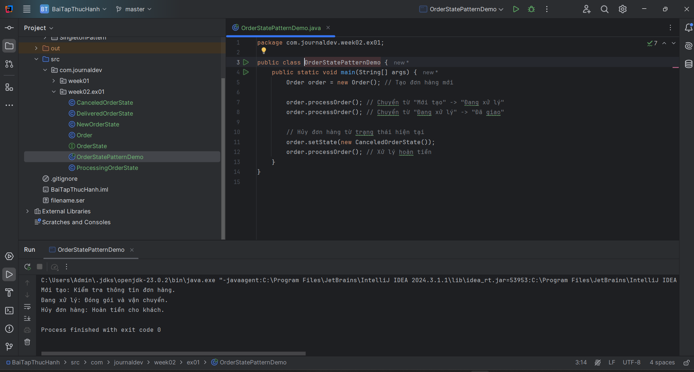
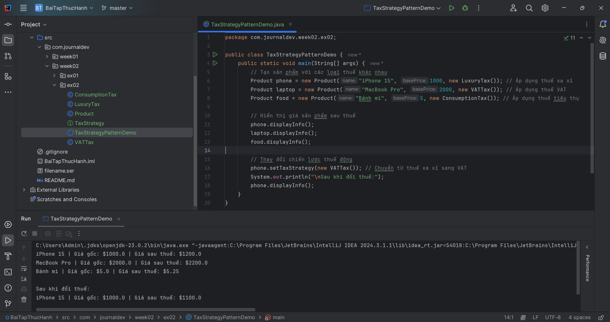
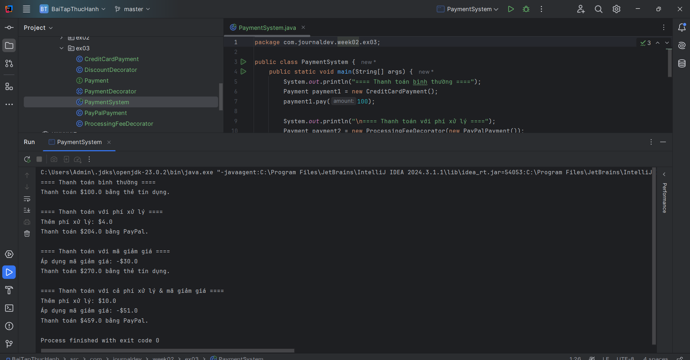

# Design Patterns Demo

## Overview

This project demonstrates two fundamental design patterns in Java: **Singleton Pattern** and **Factory Pattern**. The implementation includes code examples and visual proof of their functionality.

---

## Week01

## Singleton Pattern

The Singleton Pattern ensures that a class has only one instance and provides a global point of access to it.

### 📌 Proof of Implementation:

#### ReflectionSingletonTest


#### SingletonSerializedTest


## Factory Pattern

The Factory Pattern is a creational design pattern that provides an interface for creating objects in a superclass while allowing subclasses to alter the type of objects that will be created.

### 📌 Proof of Implementation:


---

## Week02

## Exercise 01

### 📌 Proof of Implementation:



## Exercise 02

### 📌 Proof of Implementation:



## Exercise 03

### 📌 Proof of Implementation:



---

## How to Run

1. Clone the repository:
   ```sh
   git clone <repository-url>
   ```
2. Navigate to the project directory:
   ```sh
   cd <project-directory>
   ```
3. Compile and run the test classes to see the pattern in action.

---

## Author

Developed by [Tran Trung Hieu]

